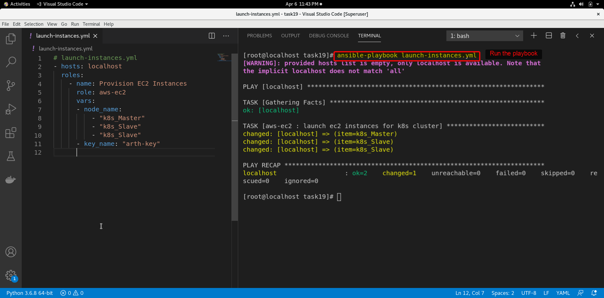

Have you tried to set up the Kubernetes cluster before manually, then you know how difficult and painful and time to solve the errors?

Can we automate it?.. Absolutely YES!!

let's plan out the things first,

- Create a Role that will Create AWS Instances for K8S master and slaves.
- Create Role to configure Kubernetes master nodes
- Create Role which will configure Kubernetes slave nodes

* * *

Create ansible setup

`$ mkdir kube-cluster && cd kube-cluster`

`$ vim ansible.cfg`

```yml
[defaults]
inventory           = hosts
roles_path          = .
host_key_checking   = False
remote_user         = ec2-user
private_key_file    = k8s.pem

[privilege_escalation]
become              =True
become_method       =sudo
become_user         =root
become_ask_pass     =False
```

we also want to use aws instances, for that also keep ec2.py file in hosts directory.

`$ mkdir hosts`

You can download this files from this [github repository.](https://github.com/ansible-collections/community.aws/tree/main/scripts/inventory)

Note: You need to install boto library. `$ pip3 install boto`

## Write a role to provision EC2 instances.

`$ ansible-galaxy init aws-ec2`

Add ec2 module step in aws-ec2/task/main.yml for provision instances for our cluster.

```yml
---
- name: launch ec2 instances for k8s cluster 
  ec2: 
    key_name: "{{  key_name }}" 
    instance_type: "{{ instance_type }}" 
    image: "{{image_id}}"
    wait: yes 
    count: 1
    vpc_subnet_id: "{{subnet_id}}"
    state: present 
    region: "{{ aws_region }}" 
    assign_public_ip: yes 
    aws_access_key: "{{ accessKey }}"
    aws_secret_key: "{{ secretKey }}"
    wait_timeout: 600 
    instance_tags:
      Name: "{{ item }}"
  loop: "{{ node_name }}"
```

As you can see we have mentioned some variables.. we want to enable user of our role can override this variables. For that we will define this variables in aws-ec2/defaults/main.yml

```yml
---
accessKey: "AKIAT2XXWXKUXWD"     # Your Access key
secretKey: "6WR2n6cUHsLwPd5nGN35"  # Access Key
node_name:                         # instance tag
- "k8s_Master"
- "k8s_Slave"
- "k8s_Slave"
    
key_name: "mydefault-key"
instance_type: "t2.micro"
image_id: ami-0eeb03e72075b9bcc
subnet_id: "subnet-35f6cc5d"
aws_region: "ap-south-1"
```

and that's it.. let's test the role.

Create our main playbook in which we will call this roles.

`$ vim k8s-provision.yml`

```yml
# launch-instances.yml
- hosts: localhost 
  roles:
    - name: Provision EC2 Instances 
      role: aws-ec2
      vars:
      - node_name:                  
          - "k8s_Master"
          - "k8s_Slave"
          - "k8s_Slave"
      - key_name: "arth-key"
```

Run the playbook

`$ ansible-playbook launch-instnaces.yml`




Now we have launched 3 aws instances, also have dynamic inventory. We can test that we can access the these instances using ansible ping module.

`$ ansible all -m ping`


All set to configure nodes as k8s master and slaves.. Let's start then;

Create Role to configure Kubernetes Cluster

First plan what things we want to do with master.

- [ ] Install Docker. (we have user amazon linux 2 which has pre-configured yum repository for docker)
- [ ] Enable and start the docker services
- [ ] Configure Kubernetes yum repository
- [ ] Install kubeadm, kubelet and kubectl
- [ ] Enable and start kubernetes services
- [ ] Pull docker configuration images for kubernetes
- [ ] Change driver to systemd from docker
- [ ] Restart docker service
- [ ] Install iproute-tc
- [ ] Change bridge -nf-call-iptables to 1
- [ ] Initialize master
- [ ] Configure master as kubernetes client
- [ ] Create Flannel for overlay network
- [ ] Generate Token so that slave can join
- [ ] Configure slave nodes
- [ ] Use master token to join the cluster

## Init

We have to follow above steps to setup kubernetes cluster. we will create ansible role to automate this steps.

`$ ansible-galaxy init k8s_cluster`

It will create directory below structure.

```markdown
k8s_cluster/
├── defaults
│   └── main.yml
├── files
├── handlers
│   └── main.yml
├── meta
│   └── main.yml
├── README.md
├── tasks
│   └── main.yml
├── templates
├── tests
│   ├── inventory
│   └── test.yml
└── vars
    └── main.yml
```

But we do not need all this files and folder. We will remove that we are not going to use and add files which are required.

Before starting let me show you final structure that will help you to understand the my role.

```markdown
k8s_cluster/
├── defaults
│   └── main.yml                            # default variables which can be override 
├── files                                         # files which we will use in this role. 
│   ├── daemon.json
│   ├── k8s.conf
│   └── kubernetes.repo
├── handlers					# handlers 
│   └── main.yml                     
├── meta
│   └── main.yml
├── README.md
└── tasks 					# tasks files 
    ├── docker-install.yml		# tasks to install docker 
    ├── kube-configure.yml            # tasks to configure k8s setup 
    ├── kube-install.yml                  # tasks to install kubernetes
    ├── main.yml                             # import all the tasks files 
    ├── master-configure.yml         # tasks to configure master node
    └── slave-configure.yml            # tasks to configure slave nodes

5 directories, 13 files
```

## Install Docker

First we have to install docker, enable and start the docker service.

Open k8s_cluster/tasks/docker-install.yml and write below tasks.

```yml
- name: install docker
  package: 
    name: docker
    state: present 

- name: start and enable docker service
  service:
    name: docker
    state: started 
    enabled: yes
```

## Install Kubernetes

Open k8s_cluster/tasks/kube-install.yml and add below tasks that will configure k8s yum repository.

Also will install kubeadm, kubelet and kubectl

```yml
- name: configure yum repo for kubernetes 
  copy: 
    src: kubernetes.repo 
    dest: /etc/yum.repos.d/kubernetes.repo 

- name: install kubeadm kubelet and kubectl 
  command: yum install kubeadm kubelet kubectl -y 

- name: start and enable kubelet service 
  service: 
    name: kubelet 
    state: started 
    enabled: yes
```

## Configure Kubernetes

Add below tasks to configure kubenetes.

```yml
- name: pull k8s configuration images 
  shell: kubeadm config images pull 
  changed_when: false 
  ignore_errors: yes

- name: configure docker cgroup 
  copy: 
    src: daemon.json 
    dest: /etc/docker/daemon.json 
  notify: "Restart docker service"

- name: install iproute-tc for traffic control 
  package: 
    name: iproute-tc 
    state: present 

- name: configure iptables 
  copy: 
    src: k8s.conf 
    dest: /etc/sysctl.d/k8s.conf 

- name: restart service
  shell: sudo sysctl --system
```

## Configure Kubernetes master

```yml
- name: pull k8s configuration images 
  shell: kubeadm config images pull 
  changed_when: false 
  ignore_errors: yes

- name: configure docker cgroup 
  copy: 
    src: daemon.json 
    dest: /etc/docker/daemon.json 
  
- name: "Restart docker service" 
  service: 
    name: docker
    state: restarted 
    
- name: install iproute-tc for traffic control 
  package: 
    name: iproute-tc 
    state: present 

- name: configure iptables 
  copy: 
    src: k8s.conf 
    dest: /etc/sysctl.d/k8s.conf 

- name: restart service
  shell: sudo sysctl --system
```

Import all the tasks in main.yml file

We will import all the separate tasks file into main playbook.

```yml
---
# tasks file for k8s_master

- name: "Install docker"
  import_tasks: "docker-install.yml"

- name: "Install kubernetes"
  import_tasks: "kube-install.yml"

- name: "Configure kubernetes"
  import_tasks: "kube-configure.yml"

- name: "Configure Master node"
  import_tasks: "master-configure.yml"
  when: inventory_hostname in groups['tag_Name_k8s_Master']

- name: "Configure Slave nodes"
  import_tasks: "slave-configure.yml"
  when: inventory_hostname in groups['tag_Name_k8s_Master']
```

## Configure Kubernetes Slave

Create one k8s_setup.yml file from which we will call our k8s cluster role.

We have alomost same setup for master and slave but for slave we have to pass the master token to join the cluster. we will add this step in main.yml file only.

```yml
- hosts: 
  - all
  #- tag_Name_k8s_Master
  #- tag_Name_k8s_Slave
  roles: 
    - name: configure kubernetes cluster and master
      role: k8s_cluster
- hosts:
  - tag_Name_k8s_Slave
  vars_prompt: 
    - name: "master_token"
      prompt: "Please enter token to JOIN master node : "
      private: no
  tasks:
  - name: join slave to master node
    shell: "{{ master_token }}"
    ignore_errors: yes 
    register: masterToken
  
  - debug:
      var: masterToken
```

and DONE!.. We have successfully  created role to configure kubernetes cluster.

Let's test it.

Run the playbook, This playbook will configure master and slave nodes on aws cloud.

`$ ansible-playbook k8s_setup.yml `


Finally, you can check at the end that kubernetes cluster has been configured successfully.


